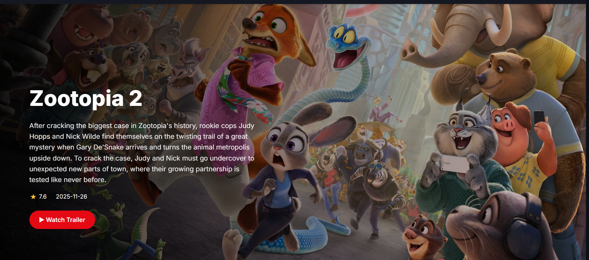
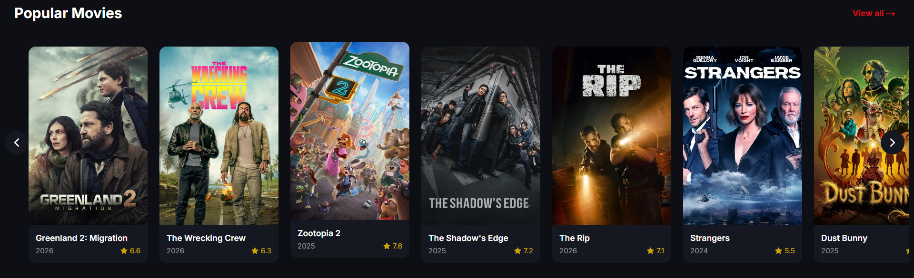

# MovieLand

Movieland is a modern, responsive web platform for discovering movies, TV shows, and actors. It aggregates data from TMDb API, providing users with rich information, trailers, cast & crew details, and search functionality.

## Promotion Video

[](https://youtu.be/r1yz6-KHa-I)

## Demo

https://movieland-gilt.vercel.app/

## Screenshots

### Home Page


### Movie Hero Slider


### TV Shows Section


### Movie Carousel



## About Me
Hello! I'm a Software Engineer who loves solving problems and building things that make a difference.
## 🔗 Links
[](http://www.usmanghani.codes/)
[](https://www.linkedin.com/in/usman-ghani-763468255/)
[](https://github.com/Usman-Builds)

## Run Locally

Clone the project

```bash
  git clone https://github.com/Usman-Builds/movieland-movie-discovery-platform.git
```

Install dependencies

```bash
  npm install
```

Start the server

```bash
  npm run start
```

